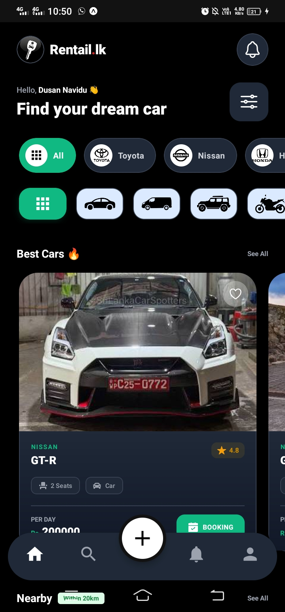

<div align="center">

  

  # 🚗 Rentail.lk
  
  **Sri Lanka's Premier Peer-to-Peer Vehicle Rental Platform**
  
  [](https://reactnative.dev/)
  [](https://firebase.google.com/)
  [](https://expo.dev/)
  [](https://www.typescriptlang.org/)
  [](./LICENSE)

  <p>
    <b>Rentail.lk</b> connects vehicle owners with renters seamlessly. Whether it's a car, bike, van, or lorry, find the perfect ride or earn passive income by listing your vehicle.
  </p>

  <a href="https://youtu.be/cB_kl0bjUes">
    
  </a>
  <br/>
  <br/>

  [View Repo](https://github.com/DusanNavidu/Rentail.lk) • [Report Bug](https://github.com/DusanNavidu/Rentail.lk/issues) • [Request Feature](https://github.com/DusanNavidu/Rentail.lk/issues)

</div>

---

## 📑 Table of Contents
- [📸 App Previews](#-app-previews)
- [✨ Key Features](#-key-features)
- [🛠️ Tech Stack](#️-tech-stack)
- [🚀 Installation & Setup](#-installation--setup)
- [⚙️ Configuration](#️-configuration)
- [📞 Contact](#-contact)

---

## 📸 App Previews

### 📱 Core User Experience
<div align="center">
  <table>
    <tr>
      <td align="center"><b>🏠 Home Screen</b></td>
      <td align="center"><b>🚙 Vehicle Details</b></td>
      <td align="center"><b>📅 Booking Flow</b></td>
    </tr>
    <tr>
      <td></td>
      <td></td>
      <td></td>
    </tr>
  </table>
</div>

### 🔥 Key Features
<div align="center">
  <table>
    <tr>
      <td align="center"><b>💬 Chat & Voice Call</b></td>
      <td align="center"><b>🚗 My Garage</b></td>
      <td align="center"><b>🌙 Dark Mode</b></td>
    </tr>
    <tr>
      <td></td>
      <td></td>
      <td></td>
    </tr>
  </table>
</div>

### ➕ Add Vehicle Process (For Owners)
<div align="center">
  <table>
    <tr>
      <td align="center"><b>1. Add Photos</b></td>
      <td align="center"><b>2. Vehicle Info</b></td>
      <td align="center"><b>3. Owner Info</b></td>
    </tr>
    <tr>
      <td></td>
      <td></td>
      <td></td>
    </tr>
    <tr>
      <td align="center"><b>4. Extra Details</b></td>
      <td align="center"><b>5. Set Location</b></td>
      <td align="center"><b>✅ Completed</b></td>
    </tr>
    <tr>
      <td></td>
      <td></td>
      <td><h3 align="center">Ready to Rent! 🚀</h3></td>
    </tr>
  </table>
</div>

---

## ✨ Key Features

### 👤 For Renters
- **🚙 Extensive Listings:** Browse Cars, Vans, Bikes, Tuk-Tuks, Lorries, and more.
- **🔍 Smart Search:** Filter by Brand (Toyota, Nissan, etc.), Price, and Location.
- **📅 Easy Booking:** Real-time availability check and price calculation based on dates.
- **📍 Map View:** View vehicle pick-up locations directly on an interactive map.
- **💬 Real-Time Chat:** Voice notes, Image sharing, and In-app calling support.

### 🚘 For Vehicle Owners
- **📝 Easy Listing:** 4-step guided form to add vehicles with photos and specs.
- **💼 Manage Requests:** Accept or Reject incoming booking requests instantly.
- **💰 Earnings Dashboard:** Visualize your income and booking performance.
- **🔄 Availability Control:** Update vehicle status and details anytime.

### ⚙️ System Highlights
- **🔐 Secure Auth:** Powered by Firebase Authentication (Email/Password & Auto-Login).
- **🌗 Theme Support:** Seamless Dark and Light mode switching.
- **📱 Responsive UI:** Optimized for both Android and iOS devices.

---

## 🛠️ Tech Stack

| Category | Technologies |
| :--- | :--- |
| **Frontend** | React Native, Expo, TypeScript |
| **Styling** | NativeWind (Tailwind CSS) |
| **Navigation** | Expo Router (File-based routing) |
| **Backend** | Firebase Firestore (NoSQL DB) |
| **Authentication** | Firebase Auth |
| **Storage** | Cloudinary (Image/Audio Hosting) |
| **Maps** | React Native Maps, Expo Location |
| **Media** | Expo AV (Voice), Expo Image Picker |

---

## 🚀 Installation & Setup

Follow these steps to get a local copy up and running.

### Prerequisites
* **Node.js** (v18 or newer)
* **npm** or **yarn**
* **Expo Go** app on your phone (or an Emulator)

### Installation

1.  **Clone the Repo**
    ```bash
    git clone [https://github.com/DusanNavidu/Rentail.lk.git](https://github.com/DusanNavidu/Rentail.lk.git)
    cd Rentail.lk
    ```

2.  **Install Dependencies**
    ```bash
    npm install
    # or
    yarn install
    ```

3.  **Start the App**
    ```bash
    npx expo start -c
    ```

---

## ⚙️ Configuration

To make the app work, you need to configure **Firebase** and **Cloudinary**.

1.  Go to [Firebase Console](https://console.firebase.google.com/).
2.  Create a new project and add a Web App.
3.  Update the `services/firebase.ts` file with your credentials.

```typescript
// services/firebase.ts
const firebaseConfig = {
  apiKey: "YOUR_API_KEY",
  authDomain: "YOUR_PROJECT_ID.firebaseapp.com",
  projectId: "YOUR_PROJECT_ID",
  storageBucket: "YOUR_PROJECT_ID.appspot.com",
  messagingSenderId: "YOUR_SENDER_ID",
  appId: "YOUR_APP_ID"
};